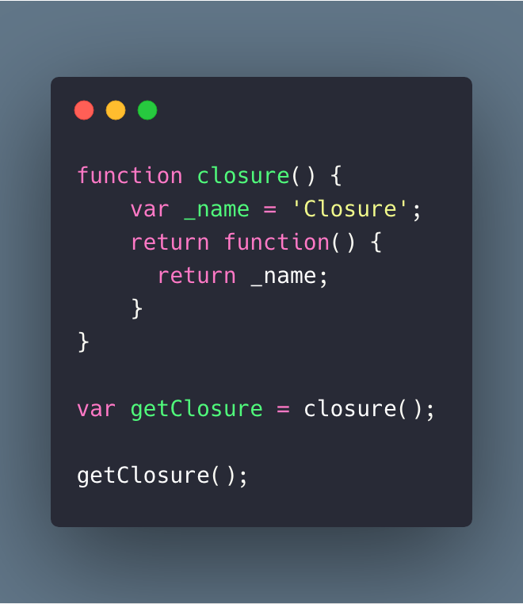

## <i class="devicon-javascript-plain colored" style="font-size: 1.3rem;"></i> 클로저란?

[MDN](https://developer.mozilla.org/ko/docs/Web/JavaScript/Guide/Closures)에서 다음과 같이 정의를 내린다.

> 함수와 함수가 선언된 어휘적 환경의 조합

우선 이해가 잘 되지 않는다. :thinking::thinking:

코드를 보자!!

```js{8}
function person() {
  var _name = 'Jason'
  return function() {
    return _name
  }
}

var getName = person() // :white_check_mark: 클로저 형성
getName() //  'Jason'
```

보통 프로그래밍에서 함수가 실행되고 나면 함수의 생명주기가 끝나기 때문에 내부에 선언되었던 변수들은 접근할 수 없는 것이 일반적이다. 하지만 자바스크립트에서는 리턴한 함수가 `closure` 환경을 형성하여 유효범위 내에 있는 변수가 참조 가능하다.

결국 위 코드를 설명하면 변수 `getName`은 `person()`의 리턴한 함수의 인스턴스에 대한 참조이며 변수 `_name`에 접근할 수 있는 어휘적 유효 범위안에 있다.

### 실용적인 클로저

클로저를 어떤 상황에서 쓰면 좋을까?

> 어떤 데이터(어휘적 환경)와 그 데이터를 조작하는 함수를 연관시켜주기 때문에 유용하다.

일반적으로 웹개발을 할 때 프론트엔드에서는 이벤트 기반으로 하는 코드를 많이 접하게 된다.

```js{13-15}
function person(name) {
  var _greet = 'Hello, '
  return function() {
    document.getElementById('result').innerHTML = _greet + name
  }
}

var $greet1 = document.getElementById('greet1')
var $greet2 = document.getElementById('greet2')
var $greet3 = document.getElementById('greet3')

// :white_check_mark: 클로저 형성
var greet1 = person($greet1.textContent)
var greet2 = person($greet2.textContent)
var greet3 = person($greet3.textContent)

$greet1.onclick = greet1
$greet2.onclick = greet2
$greet3.onclick = greet3
```

```html
<button type="button" id="greet1">Jason</button>
<button type="button" id="greet2">Jeff</button>
<button type="button" id="greet3">Jaesung</button>
<div id="result"></div>
```

각각의 버튼을 변수 `$greet1`, `$greet2`, `$greet3`에 정의하고 버튼 안에 있는 텍스트를 `person`함수의 인자값으로 할당한다. 결국 하나의 메소드를 가지고 각기 다른 클로저를 형성(`greet1`, `greet2`, `greet3`)하여 `onclick` 이벤트에 연결시켜준다.


짜잔!! 위와 같은 결과물이 나오면 성공!! :thumbsup::thumbsup:

### 클로저의 은닉화와 캡슐화

자바스크립트는 다른 프로그래밍 언어와 달리 private 기능을 지원하지 않는다. 하지만 **클로저**를 이용하여 *private 변수 및 메소드*를 흉내낼 수 있다.

```js{18,19}
function makeUser() {
  var _password = '0000000'

  function _generatePassword() {
    return (_password = Math.floor(Math.random() * 10000000).toString())
  }

  return {
    setPassword: function() {
      _generatePassword()
    },
    getPassword: function() {
      return _password
    },
  }
}

var jaesung = makeUser()
var jason = makeUser()

console.log(jaesung.getPassword()) // 0000000
console.log(jason.getPassword()) // 0000000

jaesung.setPassword()

console.log(jaesung.getPassword()) // 1044469
console.log(jason.getPassword()) // 0000000

jason.setPassword()

console.log(jaesung.getPassword()) // 1044469
console.log(jason.getPassword()) // 1362642
```

`jaesung`과 `jason`이라는 두 명의 유저를 생성했다. 그리고 생성한 유저의 초기 비밀번호는 `0000000`이다. 각각의 유저에게 임시 비밀번호를 전송해주려고 할때 **Public API**로 노출된 `setPassword` 메서드를 통해서만 발급될 수 있다. 결국 `_password` 변수와 `_generatePassword` 함수는 클로저를 형성한 이후 공유된 api인 `getPassword`, `setPassword`외에는 어디서도 접근 불가능하다. 그리고 하나의 클로저에서 변수 값을 변경해도 다른 클로저의 값에는 영향을 주지 않으며 독립성을 유지한다.

### 반복문 클로저로 해결하기

지금 보는 예제는 정말 수 없이 봐왔던 예제이다.

```js
for (var i = 0; i < 3; i++) {
  setTimeout(function() {
    console.log(i) // :thinking: 3, 3, 3  why?
  }, 1000)
}
```

변수 `i`는 `setTimeout`이 실행되기 전에 1초 동안 조건을 다 순회한 뒤 이미 3이 되어버린 상태!! 그래서 log에 3이라는 숫자가 3번 찍히는걸 볼 수 있다. 그럼 어떻게 해결해야 될까?

```js{13,17,23}
// :x: wrong way
for (var i = 0; i < 3; i++) {
  setTimeout(
    (function() {
      console.log(i) // 0, 1, 2 즉시 실행되므로 1초 뒤에 실행되지 않는다.
    })(),
    1000
  )
}

// :white_check_mark: Good!!
for (var i = 0; i < 3; i++) {
  ;(function(j) {
    setTimeout(function() {
      console.log(j) // :smiley: 0, 1, 2
    }, 1000)
  })(i)
}

// :white_check_mark: Good!!
for (var i = 0; i < 3; i++) {
  ;(function() {
    var _j = i
    setTimeout(function() {
      console.log(_j) // :smiley: 0, 1, 2
    }, 1000)
  })()
}
```

**IIFE(Immediately Invoked Function Expressions) 패턴**을 사용하여 `setTimeout` 함수 콜백에 새로운 어휘적 환경이 생성한다. 결국 `i` 값은 단일 환경이 아닌 세개의 각기 다른 환경(클로저)에서의 값을 소유하게 된다.

```js{1}
// :thumbsup: Better!!
for (let i = 0; i < 3; i++) {
  setTimeout(function() {
    console.log(i) // 0, 1, 2
  }, 0)
}
```

각각의 클로저 환경을 생성하는 것보다는 ES6 문법인 `let` 키워드를 사용하여 `i`를 `{}` 블록 범위 단위의 스코프로 각각 형성하는 것이다. 그럼 `for` 구문이 순회할 때마다 각기 다른 값이 다른 스코프에 저장되어 올바르게 출력되는걸 확인할 수 있다.

### 클로저 성능

> As long as closures are active, this memory cannot be garbage collected. Therefore, closures can lead to memory leaks if not used well.

즉 다시 말해서, 클로저가 활성화 되어 있는 동안, 메모리는 GC가 회수하지 않을 수 있다. 그러므로 잘 사용하지 않으면 메모리 누수가 발생할 수 있다. :sob::sob:

그럼 해결 방법은?

```js{11}
function closure() {
  var _name = 'Closure'
  return function() {
    return _name
  }
}

var getClosure = closure()
console.log(getClosure()) // closure

getClosure = null // :thumbsup: important
```

클로저 사용이 끝난 뒤 `null` 값으로 제거해준다.

### Wrap-up

지금까지 **클로저**에 대한 기본개념, 응용, 문제해결, 성능 이슈에 대해 다루어봤다. 이번에 정리하고 나니 몬가 콱 막힌 부분이 풀리는(?) 느낌이 살짝 드는것 같다. :smiley::smiley:

### Perference

- [MDN 클로저](https://developer.mozilla.org/ko/docs/Web/JavaScript/Guide/Closures#%EC%8B%A4%EC%9A%A9%EC%A0%81%EC%9D%B8_%ED%81%B4%EB%A1%9C%EC%A0%80)
- [DailyEngineering 블로그](https://hyunseob.github.io/2016/08/30/javascript-closure/)
