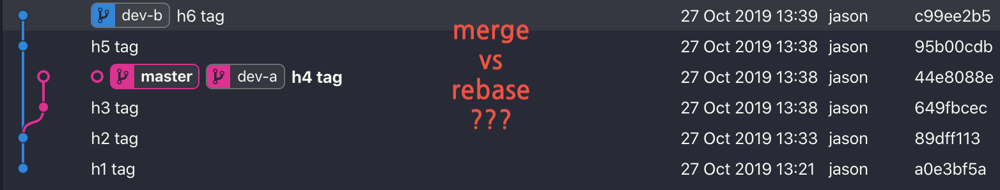
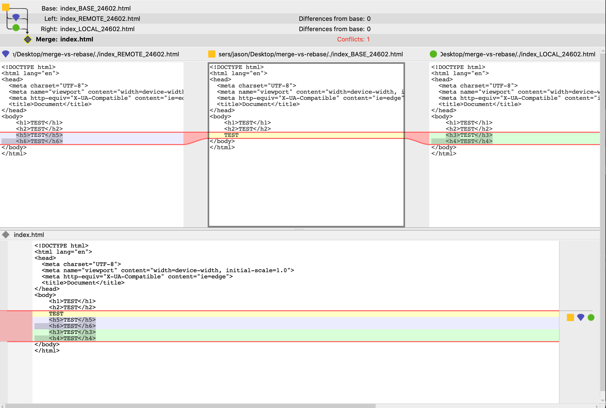
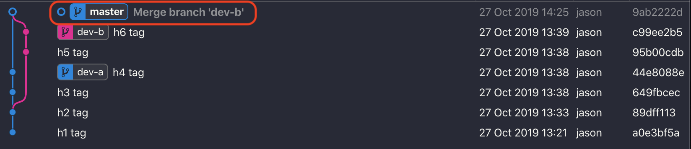
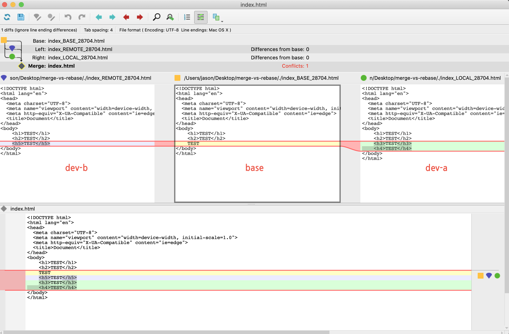
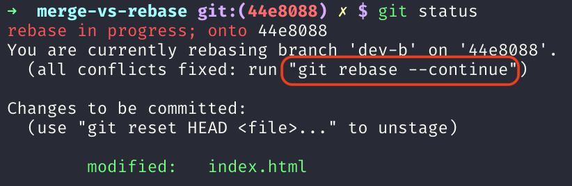
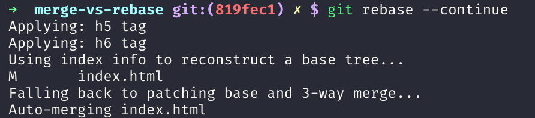
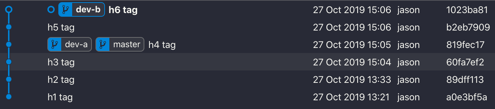
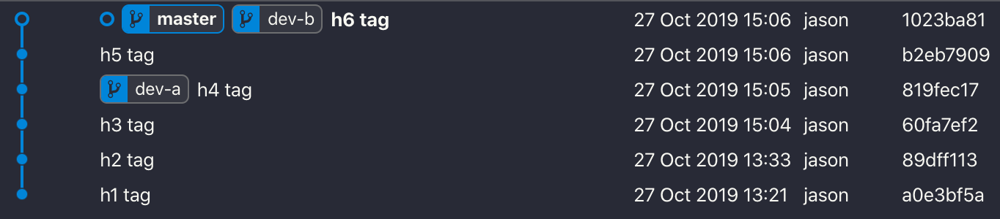
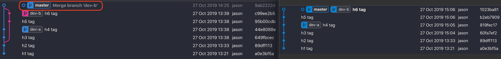

## merge와 rebase의 차이 이해하기



### merge vs rebase

이번 포스팅을 통해 `merge`와 `rebase` 차이를 이해하고 넘어가보겠다.
서로 다른 두 브랜치 간에 병합을 진행할 때 `merge`를 사용해왔었지만 git log의 지저분한 merge 기록을 깨끗이 정리하면서 병합을 진행하고 싶을 때가 있다.

바로 그 때 `rebase`를 사용하면 된다.

이제 간단한 예제를 통해 실습을 진행해보겠다. 두 개의 로그 그래프를 비교하기 위해 위와 같은 비슷한 상황을 연출해보자.

### merge

현재 `master` 브랜치이다.

```bash
$ git merge dev-b
```

`dev-b` 브랜치를 `master` 브랜치와 병합을 진행하면 충돌이 난다. 왜 나는지 **3-way-merge** 툴인 p4merge를 통해 한 번 살펴보겠다.



가운데 `base` 기준으로 `dev-a`(오른쪽), `dev-b`(왼쪽) 작업 내역을 비교해봤을 때 서로 같은 줄에서 다른 작업들을 했으니 auto-merging이 되지 않는다. 결국 개발자가 수정한 다음 커밋해야한다.

```html
<h1>TEST</h1>
<h2>TEST</h2>
<h3>TEST</h3>
<h4>TEST</h4>
<h5>TEST</h5>
<h6>TEST</h6>
```

위와 같은 순서로 수정을 한 다음 커밋을 해보겠다.

```bash
$ git commit
```

커밋 메세지를 따로 작성하지 않으면 **Merge branch 'dev-b'**라는 메세지가 자동으로 작성된다.



그럼 위와 같이 새로운 커밋이 하나 다시 생기고 병합이 병렬적으로 진행되는걸 볼 수 있다.

### rebase

이번에 `rebase`로 병합을 진행하기 위해 처음과 같은 상황에서 시작해보겠다.

```bash
$ git checkout dev-b
$ git rebase master
```

`dev-b` 브랜치로 바꾼 이유는 `master` 브랜치 다음에 병합을 진행을 하기 위해서이다. 이번에도 충돌이 난다. 왜 나는지 살펴보자.



```html
<h1>TEST</h1>
<h2>TEST</h2>
<h3>TEST</h3>
<h4>TEST</h4>
<h5>TEST</h5>
```

위와 같이 수정한 다음 **Staging Area**까지 커밋하고 상태를 체크해보자.



충돌을 해결했으나 아직 다 병합한게 아니기 때문에 `rebase`를 계속 진행할 것인지 아님 뒤로 다시 돌아갈 것인지 선택해야한다.

```bash
$ git rebase --continue
```

충돌이 나지 않는다면 **Auto-merging** 작업이 잘 진행된다.



그리고 결과적으로 아래와 같은 로그 그래프가 나온다.



하지만 아직 `master` 브랜치는 병합한 코드를 가지고 있지 않다. `master` 브랜치를 기준으로 해서 `dev-b` 브랜치에서 병합 진행을 했기 때문이다.

```bash
$ git checkout master
$ git merge dev-b
```

위와 같이 브랜치를 변경해서 `Fast-forwarding` 작업을 진행하면 아래와 같은 결과가 나온다.



### merge vs rebase 로그 비교



왼쪽이 `merge`를 통한 병합 과정이고 오른쪽이 `rebase`를 통한 병합 과정이다.

### Wrap-up

결론적으로 `merge`와 `rebase`는 개발팀의 문화 및 프로젝트 성격에 따라 적절하게 사용하면 될 것 같다. 예를 들어 작업한 커밋 히스토리 하나하나가 중요하고 변경이 있어서는 안된다고 생각된다면 `merge`를, git graph 로그를 다듬어서 관리하기를 원한다면 `rebase`를 선택하면 될 것 같다.
