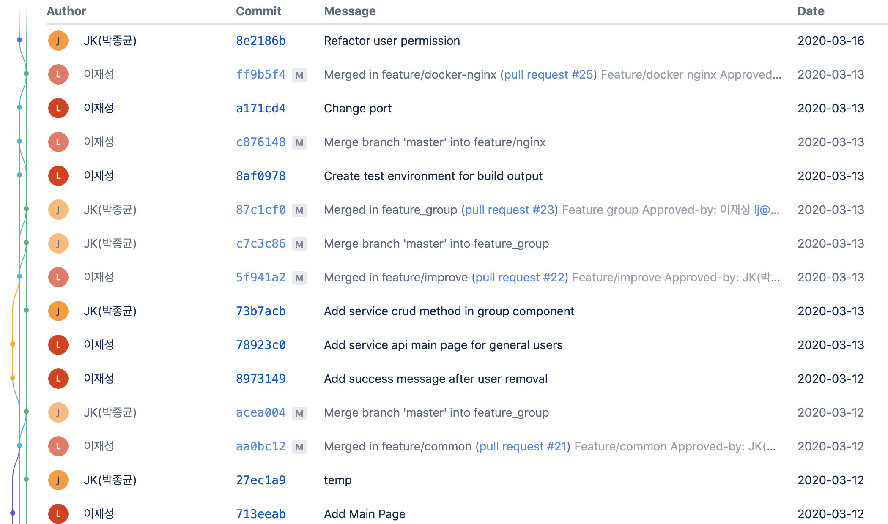
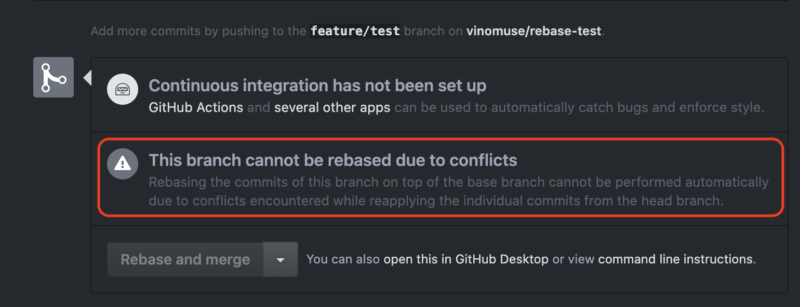
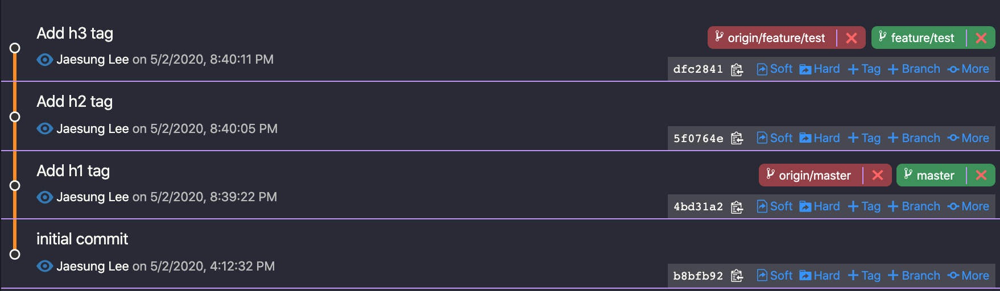
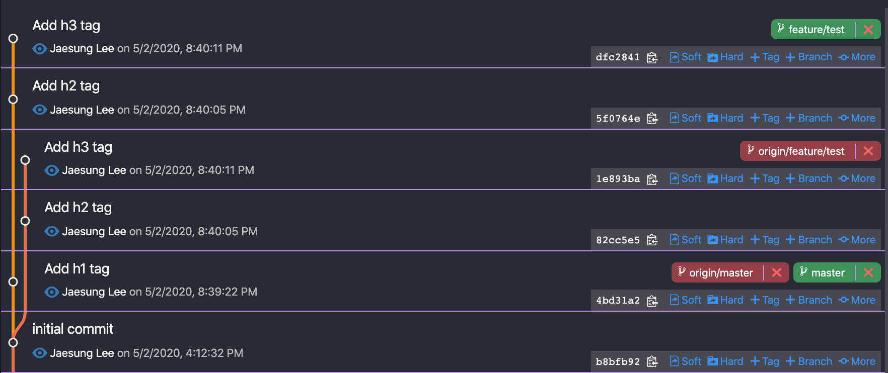
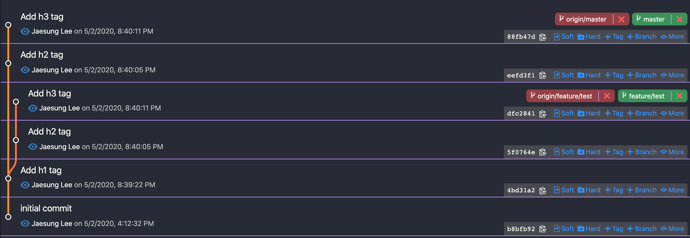
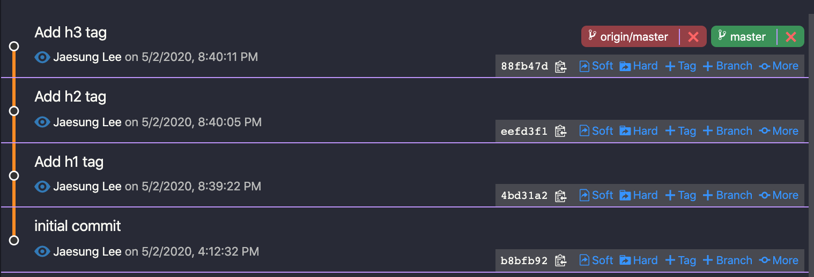
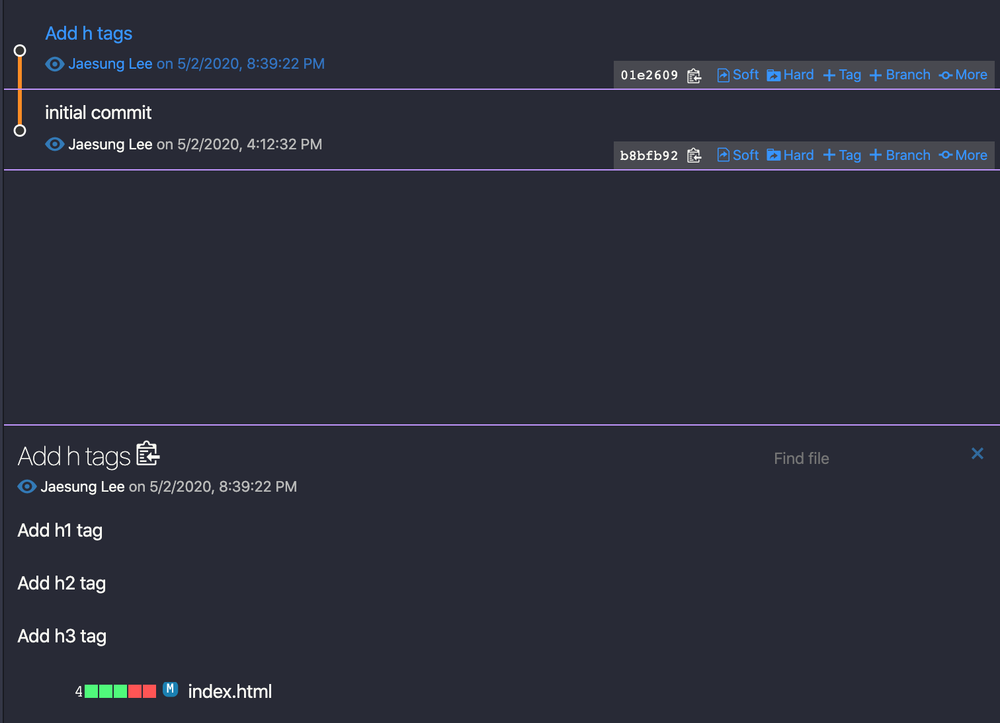

최근 **rebase**를 활용해서 병합 작업 및 commit log 수정, 합치는 작업을 진행해봤는데 공유하면 좋을 것 같아 몇 자 적어보겠다. :smiley::smiley::smiley:

## <i class="devicon-git-plain colored" style="font-size: 1.3rem;"></i> rebase 란?

> 영어 사전에 의하면 **새로운 평가 기준을 설정한다.**

commit log들을 재배치하면서 커밋 라인을 깔끔하게 정리해주기 때문에 히스토리 파악이 쉬워진다.

### rebase로 병합하기



> 회사 프로젝트 bitbucket commit log 상황

지금까지 협업할 때 `pull request`를 요청한 이후 승인이 나면 _merge commit_ 전략으로 병합을 진행해왔다. 하지만 로그가 너무 복잡해지다보니 해당 커밋으로 되돌려야하는 경우가 생겼을 때 단번에 되돌리는 것도 힘들고 로그 파악이 제대로 되지 않는 단점이 있었다. :cry::cry:



> Github에서 pull request를 만들고 conflict를 해결한 뒤 rebase and merge를 할 수 없는 상황

`pull request`를 요청하면 `master` 브랜치와 `feature/branch`를 비교를 해서 merge를 할텐데 conflict가 날 경우 원격 소스 자체에서 conflict를 해결해야하기 때문에 _rebase and merge_ 가 활성화되지 않는다.


물론 `squash and merge` 전략으로 해결하면 `merge commit` 전략과 달리 병렬적으로 로그가 생기지는 않아 히스토리가 정리된다. 하지만 하나의 커밋으로 합쳐지면서 병합되기 때문에 나중에 이슈가 생길 경우 해당 커밋로그로 돌아가는 것이 불가능해지는 단점이 있다. 해당 커밋로그도 유지되면서 병합을 진행하고 싶다. ㅋㅋ

그럼 해결방법은? :thinking:



> 이미 feature/branch push한 상황

```bash
$ git rebase master
```

간단하다. 해당 `feature/branch`를 푸쉬하기 전에 `master` 브랜치 기준으로 해서 `rebase` 병합을 진행해주면 된다.

```bash
$ git rebase --continue
```

conflict가 날 경우 해결한 뒤에 `git add`(staging area)까지 진행한 다음 위 명령어를 진행해주면 된다.

로컬 자체에서 conflict를 다 해결했기 때문에 `pull request`를 요청한 다음 승인이 나면 `rebase and merge`로 병합을 진행해주면 된다.

참고) **github**는 `rebase and merge`, **Bitbucket**은 `fast forward`라고 부른다.



> rebase로 merge를 한 상황

위에서 보듯이 origin/feature/test가 있는 것으로 보아 push를 한번 한 상황이다.
이럴 경우 push를 다시 하면 아래와 같은 에러가 일어난다.

_Updates were rejected because the tip of your current branch is behind_

현재 브랜치가 원격 브랜치보다 뒤쳐져 있기 때문이라고 하는데 이거 무시하고 강제 푸쉬를 진행한다.

```bash
$ git push origin +feature/branch
```


> 강제 푸쉬한 이후



> pr 요청 승인하고 rebase and merge 하고 난 뒤 master branch에서 pull 한 이후

`feature/branch`가 `master` 랑 잘 병합되면 지워주는 것을 원칙으로 한다.

> 위 내용은 팀 및 프로젝트마다 다르므로 의견을 나눈 뒤 진행한다.

```bash
$ git branch -D feature/branch
$ git push origin --delete feature/branch
$ git remote prune origin
```

- `git remote prune origin` - remote에서 삭제한 브랜치를 자동으로 업데이트해준다. 로컬에서 자동으로 삭제



> 원격/로컬 feature/branch 다 지운 이후

### rebase로 commit 로그 정리해보기

회사의 기존 프로젝트에서 병합할 때 `cherry-pick`을 사용하여 병합을 진행한다. 근데 문제점이 발생한다. 작업이 다 끝났고 commit log는 10개가 넘었다. 병합해야 되는 브랜치는 testing, patch, staging, master까지 차례대로 `cherry-pick`을 해야 한다. 🥵🥵🥵

```bash
$ git rebase -i HEAD~3
```

HEAD~ + 작업한 commit 로그 갯수를 적어주면 아래와 같은 내용이 vim으로 나온다.

```vim
pick 4bd31a2 Add h1 tag
pick eefd3f1 Add h2 tag
pick 88fb47d Add h3 tag

# Rebase b8bfb92..88fb47d onto b8bfb92 (3 commands)
#
# Commands:
# p, pick <commit> = use commit
# r, reword <commit> = use commit, but edit the commit message
# e, edit <commit> = use commit, but stop for amending
# s, squash <commit> = use commit, but meld into previous commit
# f, fixup <commit> = like "squash", but discard this commit's log message
# x, exec <command> = run command (the rest of the line) using shell
# b, break = stop here (continue rebase later with 'git rebase --continue')
# d, drop <commit> = remove commit
# l, label <label> = label current HEAD with a name
# t, reset <label> = reset HEAD to a label
# m, merge [-C <commit> | -c <commit>] <label> [# <oneline>]
# .       create a merge commit using the original merge commit's
# .       message (or the oneline, if no original merge commit was
# .       specified). Use -c <commit> to reword the commit message.
#
# These lines can be re-ordered; they are executed from top to bottom.
#
# If you remove a line here THAT COMMIT WILL BE LOST.
#
# However, if you remove everything, the rebase will be aborted.
#
# Note that empty commits are commented out
```

자주 사용하는 것들만 정리해보고 가겠다.

- `reword` : commit 메세지만 변경한다.
- `edit` : 코드 수정 및 commit 메세지 변경한다.
- `squash` : 이전 커밋과 병합한다.
- `fixup` : commit 로그만 버린다.
- `drop` : commit 자체를 지운다. (해당 라인 자체를 지워도 커밋은 제거된다.)

```vim
pick 4bd31a2 Add h1 tag
s eefd3f1 Add h2 tag
s 88fb47d Add h3 tag
```

위와 같이 수정한 다음 저장하고 새로운 커밋 메세지를 적어주면 아래와 같이 하나의 커밋으로 합쳐진다.



다시 되돌리고 싶은 경우는 아래 명령어를 참고한다.

```vim
$ git reflog
$ git reset --hard HEAD@{number}
```

### Wrap-up

지금까지 rebase를 잘 활용하지 못했었는데 이번 기회로 잘 이해하고 넘어갈 수 있었던 것 같다. 확실히 회사에 적용해야 이해도 잘 되고 보람찬 것 같다. 다음번에도 좋은 내용 있으면 공유하도록 하겠다.

### Reference

- [커밋 히스토리를 이쁘게 단장하자](https://evan-moon.github.io/2019/08/30/commit-history-merge-strategy/)
- [git squash - 여러개의 커밋로그를 하나로 묶기](https://meetup.toast.com/posts/39)
