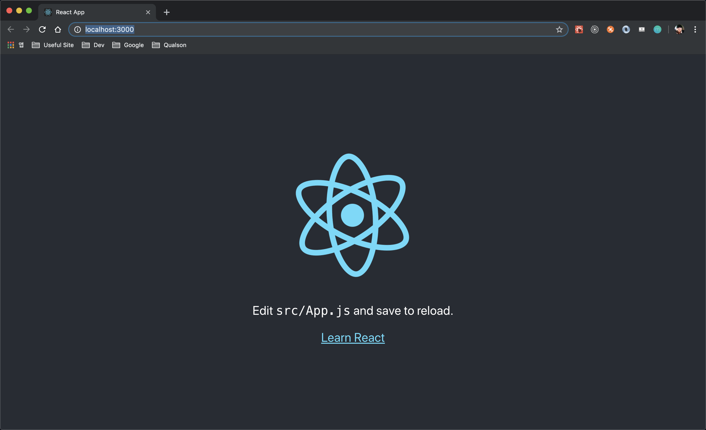

이번에 드디어 react 기반인 `gatsby`로 블로그를 마이그레이션하게 되었다. 콘텐츠도 그대로 이전할 생각도 있었지만 다시 공부해서 올리는게 개인적으로 도움이 될 것 같았다. 그래서 어떤 포스팅을 먼저 올릴까 고민해보았는데 역시 내가 제일 좋아하는 `react`로...:smiley::smiley::smiley:

## <i class="devicon-react-original colored" style="font-size: 1.3rem;"></i> 리액트

리액트는 페이스북에서 나온 UI 라이브러리이며 [리액트 공식 홈페이지](https://reactjs.org/) 메인에 3가지로 정의를 내린다.

> Declarative, Component-Based, Learn Once, Write Anywhere

즉, 다시말해서 '선언적이며, 컴포넌트를 기반으로 둔 개발이며, 한 번 배워서 어디서든지 쓸 수 있다.'라고 정의를 내린다.
그럼 바로 Facebook에서 제공하는 `create-react-app`을 통해 리액트 프로젝트를 만들어보자.

```bash
$ mkdir react-test && cd react-test
$ npx create-react-app .
$ yarn start
```



### setState

이제부터 간단한 counter 예제를 통해 react의 중요한 개념인 `setState` 함수에 대해 알아보자!

```js{10}
// Counter.js
import React from 'react'

class Counter extends React.Component {
  state = {
    number: 0,
  }

  handleIncrease = () => {
    this.setState(prevState => ({ number: prevState.number + 1 })); :white_check_mark:
    // this.state.number = this.state.number + 1 :x:
    // console.log(this.state.number);
  }

  render() {
    return (
      <div className="counter">
        <p>You clicked {this.state.number} times</p>
        <button onClick={this.handleIncrease}>+</button>
      </div>
    )
  }
}

export default Counter
```

리액트에서 상태값(state)을 업데이트 하기 위해선 `setState` 함수를 통해서 업데이트를 해야한다. 만약 state를 직접 변경한다면 화면에 변경된 값은 렌더링되지 않을 것이다. 그 이유는 리액트에선 이전 상태값과 기존 상태값을 비교해서 화면에 리렌더링하는 구조로 설계되어있다. `setState` API 호출하는 것을 잊지 말자!

```js{6}
state = {
  title: 'counter',
  number: 0,
  user: {
    name: 'Jason',
    age: 35,
  },
}
```

만약 위와 같은 state 구조라면 어떤식으로 user의 age 값을 업데이트 해야할까?

```js{10}
// :x: wrong way
this.setState(prevState => ({
  user: {
    age: prevState.user.age + 1,
  },
}))
// :white_check_mark: right way
this.setState(prevState => ({
  user: {
    ...prevState.user, // :thumbsup: important
    age: prevState.user.age + 1,
  },
}))
```

첫번째 방식처럼 이전 user 상태값을 업데이트하면 user의 객체는 변경되어버린다. 참고로 setState는 **shollow copy**, 즉 얕은 복사만 할 수 있다. 그래서 깊은 복사는 ES6 문법인 `spread operator`를 이용하여 이전 객체를 copy한 뒤 age 값을 변경해야한다.

### Handling Events

리액트에서 이벤트 핸들링을 어떻게 하는지 알아보자!

```js{12,16,25}
// Counter.js
import React, { Component } from 'react'

class Counter extends Component {
  constructor(props) {
    super(props)

    this.state = {
      number: 0,
    }

    this.handleIncrease = this.handleIncrease.bind(this) // :white_check_mark:
  }

  handleReset() {
    console.log(this) // :sob: undefined
    this.setState(prevState => ({ number: 0 }))
  }

  handleIncrease() {
    this.setState(prevState => ({ number: prevState.number + 1 }))
  }

  // :white_check_mark:
  handleDecrease = () => {
    this.setState(prevState => ({ number: prevState.number - 1 }))
  }

  render() {
    return (
      <div className="counter">
        <p>You clicked {this.state.number} times</p>
        <button onClick={this.handleReset}>Reset</button>
        <button onClick={this.handleIncrease}>+</button>
        <button onClick={this.handleDecrease}>-</button>
      </div>
    )
  }
}

export default Counter
```

우선 `handleReset` 함수를 살펴보자. 브라우저를 열고 reset 버튼을 클릭한 순간 _TypeError: Cannot read property 'setState' of undefined_ 라는 에러가 난다. 로그도 확인해보니 `this`는 _undefined_ 라고 출력된다. 해결하는 방식은 두가지가 있다.

- 일반함수(`handleIncrease`)로 선언하고 이벤트를 연결할 경우 컴포넌트가 만들어질때마다 호출되는 함수인 `constructor`를 호출해준다. 그리고 `handleIncrease` 함수에서 사용되는 `this`가 `constructor` 안에서 사용되는 `this`라는 것을 명시해준다.
- 두번째 방식은 ES6 문법인 `arrow function`을 사용하여 `this`의 문제를 해결하는 것이다. `화살표 함수`의 `this`는 항상 상위 스코프의 `this`를 지칭하기 때문에 `Counter` 클래스를 가리킨다.

### Performance Optimization

컴포넌트 최적화에 대해 살펴보자. 우선 간략히 랜덤 함수를 만들어서 300개 데이터를 뿌려주는 컴포넌트를 작성해보도록 하자.

```js{33}
// App.js
import React, { Component } from 'react'
import List from './List'

import logo from './logo.svg'
import './App.css'

let rotate = -10

class App extends Component {
  id = 0

  state = {
    isRunning: false,
    startTime: null,
    data: [],
  }

  handleRunner = () => {
    const startTime = new Date().getTime()
    this.setState(() => ({
      isRunning: true,
      startTime,
    }))
  }

  getRandom() {
    this.setState(
      prevState => ({
        data: [
          ...prevState.data.slice(Math.round(Math.random())),
          {
            id: this.id++, // :thumbsup: important
            number: parseFloat(Math.random() * 100).toFixed(4),
          },
        ],
      }),
      () => {
        this.state.isRunning && setTimeout(() => this.getRandom(), 0)
      }
    )
  }

  componentDidUpdate(prevProps, prevState) {
    if (!prevState.isRunning && this.state.isRunning) {
      this.getRandom()
    }

    if (this.state.data.length === 300) {
      const endTime = new Date().getTime()

      this.setState(prevState => ({
        isRunning: false,
        data: [],
      }))

      alert(
        `Completed! Total time taken in milliseconds. : ${endTime -
          this.state.startTime}`
      )
    }
  }

  render() {
    const { handleRunner } = this
    const { isRunning, data } = this.state
    rotate += 10

    return (
      <div className="App">
        <header className="App-header">
          <h1>Performance Test</h1>
          
        </header>
        <div className="content">
          <button className="btn" onClick={handleRunner} disabled={isRunning}>
            {!isRunning ? 'start' : 'stop'}
          </button>
          <List data={data} />
        </div>
      </div>
    )
  }
}

export default App
```

위 코드를 간략히 설명하면 start 버튼을 누르면 프로그램이 시작되면서 무작위 값을 가지고 있는 하위 컴포넌트를 300개까지 최대한 빨리 render하는 로직이다. 성능의 수준은 프로그램이 끝날 때 나타내는 ms단위로 측정한다.

```js{11}
// List.js
import React from 'react'
import Item from './Item'

const List = ({ data }) => {
  return (
    <ul>
      {data.map((item, idx) => {
        // return <Item number={item.number} />  :x: error
        // return <Item key={idx} number={item.number} />  :x: wrong way
        return <Item key={item.id} number={item.number} /> // :white_check_mark: right way
      })}
    </ul>
  )
}

export default List
```

리액트에서 배열을 렌더링할 때 `key`값을 부여해야한다. 만약 `key`값을 부여하지 않고 Item 컴포넌트를 return 시킬 경우 _Warning: Each child in a list should have a unique "key" prop._ 고유한 값을 `key`으로 전달하라는 경고 메세지와 함께 에러가 발생한다. `map` 함수의 두번째 파라미터인 index 값을 `key`값으로 전달할 경우도 단순 경고만 감출뿐 성능상으로 `key`가 없는 것과 같은 결과를 보여준다. 결국 올바른 방식은 배열안에 있는 **객체의 고유한 값(Unique id)**으로 `key`값을 설정해주면 고유값으로 인해서 무언가 변화가 감지되면 기존 DOM은 그대로 유지되고 변화가 필요한 DOM에만 업데이트가 발생한다.

```js{5-7}
import React, { Component } from 'react'

class Item extends Component {
  // :thumbsup: important
  shouldComponentUpdate(nextProps, nextState) {
    return this.props.number !== nextProps.number
  }

  render() {
    const { number } = this.props
    return (
      <li
        style={{
          position: 'relative',
          overflow: 'hidden',
        }}
      >
        <span style={{ fontSize: '0.75rem' }}>{number}</span>
        <div
          style={{
            position: 'absolute',
            left: '0',
            top: '0',
            opacity: '0.4',
            width: '100%',
            height: '100%',
            background: 'skyblue',
            transform: `translateX(${Math.random() * 100}%)`,
            transition: '0.1s',
          }}
        />
      </li>
    )
  }
}

export default Item
```

이제 컴포넌트 최적화의 마지막이다. Virtual DOM에 렌더링되는 resource를 아끼기 위하여 lifecycle method인 `shouldComponentUpdate`를 이용하여 현재값과 다음값의 변화가 다를 경우에만 컴포넌트를 렌더링시킨다.

- return 값이 `true`일 경우 -> `render` 호출
- return 값이 `false`일 경우 -> `render` 함수 호출 안됨!

<iframe src="https://codesandbox.io/embed/clever-elbakyan-hngim?fontsize=14" title="clever-elbakyan-hngim" style="width:100%; height:500px; border:0; border-radius: 4px; overflow:hidden;" sandbox="allow-modals allow-forms allow-popups allow-scripts allow-same-origin"></iframe>

[](https://codesandbox.io/s/clever-elbakyan-hngim?fontsize=14)

### Wrap-up

위에서 언급한 3가지가 리액트 어플리케이션을 제작하면서 기본적이고 중요하다고 생각되는 개념들이다. 오랜만에 블로그를 작성하다보니 재미도 있지만 머릿속으로 이해했던 내용을 글로 풀어내려고 하는 것은 여전히 어려운 것 같다. 노력하는 수밖에 없다. Let's keep at it. :smiley::smiley::smiley:

### Reference

- [velopert 블로그](https://velopert.com/category/dev-log/tech-log/react-js)
