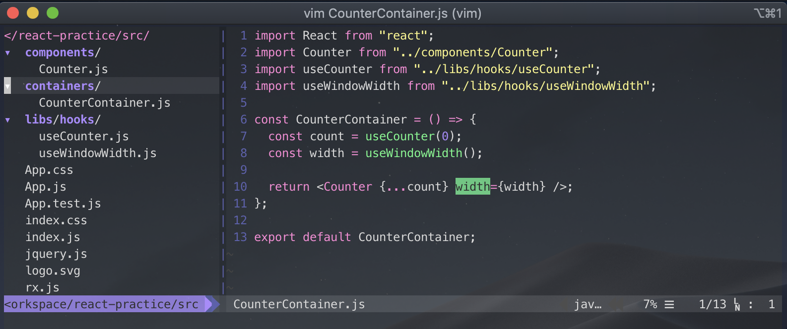
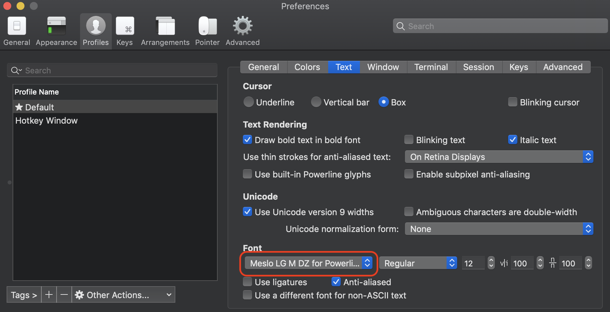
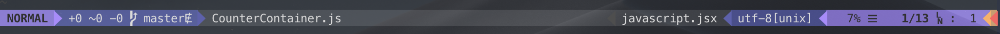

## <i class="devicon-vim-plain colored" style="font-size: 1.3rem;"></i> Vim

주로 개발을 하다가 terminal 창에서 코드를 수정하거나 문서를 작성해야되는 경우가 종종 생긴다. 하지만 `Vim` 사용법도 너무 어렵고 코드 하이라이팅 및 단축키를 잘 몰라 항상 VS Code나 다른 IDE를 열어서 주로 해결을 한다. 이제 더 이상 외부툴에 의존하지 않고 터미널 내부에서 해결하고 싶은 욕심이 생겼다. `Vim`에 대한 갈증을 풀기 위한 포스팅이다.:smiley::smiley:

### Vim 플러그인 패키지

기본적으로 UI가 이뻐야 쓰고 싶어지기 때문에 먼저 여러 플러그인들을 설치해보고 나서 사용법을 익혀보겠다. 플러그인을 설치하기 이전에 플러그인을 설치하는데 필요한 툴을 설치해보겠다. 검색해보면 `Vundle`, `vim-plug`, `pathogen`이 있다. Star수가 가장 많은 Vundle을 이용하여 플러그인 설치해보겠다.

```bash
$ git clone https://github.com/VundleVim/Vundle.vim.git ~/.vim/bundle/Vundle.vim
$ vim .vimrc
```

우선 vunlde.vim을 깃허브로부터 클론을 받은 뒤 `.vimrc` 파일을 만들어 보자.

```vim{12}
set nocompatible              " be iMproved, required
filetype off                  " required

" let Vundle manage Vundle, required
set rtp+=~/.vim/bundle/Vundle.vim
call vundle#begin()

Plugin 'VundleVim/Vundle.vim'

" 여기 부분부터 설치할 플러그인들을 작성해주면 된다.
" ex) Plugin 'scrooloose/nerdtree'
👉👉👉

call vundle#end()            " required
filetype plugin indent on    " required
```

위 코드는 `Vundle` 플러그인을 위한 필수 코드들이다. 그리고 하이라이트된 부분에 설치할 플러그인들을 예제와 같이 작성해준다.

```vim{1-6}
Plugin 'scrooloose/nerdtree'        " tree 구조로 폴더 및 파일을 볼 수 있는 플러그인
Plugin 'vim-airline/vim-airline'    " Vim 상태바 개선해주는 플러그인
Plugin 'airblade/vim-gitgutter'     " Git으로 변경된 부분 표시해주는 플러그인
Plugin 'tpope/vim-fugitive'         " Git의 현재 브랜치 및 상태 등을 표시해주는 플러그인
Plugin 'vim-syntastic/syntastic'    " 문법 체크해주는 플러그인
Plugin 'ctrlpvim/ctrlp.vim'         " 파일 찾기 플러그인
Plugin 'dracula/vim'                " 색상 테마 플러그인

Plugin 'pangloss/vim-javascript'    " 자바스크립트 플러그인
Plugin 'leafgarland/typescript-vim' " 타입스크립트 플러그인
Plugin 'mxw/vim-jsx'                " jsx 문법 플러그인
```

하이라이팅된 플러그인들은 [블로그](https://blog.b1ue.sh//vim-ide/)의 추천 플러그인들이다. 그럼 설치 및 삭제 방법을 알아보겠다.

```bash
$ :PluginInstall
$ :PluginClean
$ :PluginList
```

- `PluginInstall` - 플러그인을 설치할 목록을 작성해주고 저장(`w`)한 다음에 `ESC`키를 누른 다음 `:PluginInstall`을 한다.
- `PluginClean` - 사용하지 않을 플러그인을 목록에서 삭제해주고 저장(`w`)한 다음에 `ESC`키를 누른 다음 `:PluginClean`을 한다.
- `PluginList` - 설치한 플러그인 리스트 보기

설치한 플러그인들 중에 몇 가지는 추가 설정이 필요하다. 아래 코드는 syntastic, ctrlp.vim, vim-airline, 테마 플러그인을 위한 설정이다.

```vim
" recommended settings for syntastic
set statusline+=%#warningmsg#
set statusline+=%{SyntasticStatuslineFlag()}
set statusline+=%*

let g:syntastic_always_populate_loc_list = 1
let g:syntastic_auto_loc_list = 1
let g:syntastic_check_on_open = 1
let g:syntastic_check_on_wq = 0

" 속도 향상을 위해 이런 디렉토리를 무시할 수 있는 설정(ctrlp.vim)
let g:ctrlp_custom_ignore = {
  \ 'dir':  '\.git$\|public$\|log$\|tmp$\|vendor$',
  \ 'file': '\v\.(exe|so|dll)$'
\ }

" powerline font 적용
let g:airline_powerline_fonts = 1

" 테마 설정
color dracula
```

`Vim` 상태바를 이쁘게 하기 위해서 *powerline font*를 적용해야한다. 이건 옵션이므로 건너뛰어도 상관없다. ㅎㅎ

```bash
# clone
git clone https://github.com/powerline/fonts.git --depth=1
# install
cd fonts
./install.sh
# clean-up a bit
cd ..
rm -rf fonts
```



터미널 환경 설정에서 font를 바꿔주면 상태바 및 git 관련 아이콘이 이쁘게 노출될 것이다.:smiley:



### Vim 기본 환경 설정

`Vim`의 여러 환경 설정이 있지만 필요한 설정 몇 가지만 알아보겠다. 아래 내용은 `.vimrc` 파일 최상단에 작성한다.

```vim
syntax on         " 문법 하이라이트

set noswapfile    " swap파일 생성 안함
set number        " 라인 체크
set smartindent   " 스마트 들여쓰기
set tabstop=2     " 탭 들여쓰기 2칸
set shiftwidth=2  " 자동 들여쓰기 2칸
set hlsearch      " 검색어 강조
```


지금까지 작성한 `.vimrc` 내용이다.

### Vim 사용법

우선 난 vim을 light하게 사용할 목적이기 때문에 간단한 사용법만 알아보겠다.

```vim
h - 커서 왼쪽 이동
l - 커서 오른쪽 이동
k - 커서 위로 이동
j - 커서 아래 이동
i - 현재 위치에서 입력 가능
o - 현재 커서에서 아래칸으로 내려오면 입력 가능
shift + ^ - 현재 라인에서 맨앞으로 이동
shift + a - 현재 라인에서 맨끝으로 이동하면서 입력 가능
x - 현재 위치에서 문자 삭제
dd - 현재 행 삭제
u - undo 기능
ctrl + r - redo 기능
shift + v - Visual line 기능
ctrl + v - Visual Block 기능
:number - 라인으로 이동
:$ - 파일 맨 마지막 라인으로 이동
:%s - replace 기능. ex):%s/getName/getValue 👉 getName -> getValue
/keyword - 키워드 찾기 ex)/function 👉 function 키워드 찾아줌
n - 키워드 찾은 이후 next 키워드
shift + n - 키워드 찾은 이후 prev 키워드

ctrl + p - 파일 찾기 단축키 (ctrlp.vim 플러그인)
:NERDTree - NerdTree 켜기 (nerdtree 플러그인)
:NERDTreeToggle - NerdTree 토글 기능 (nerdtree 플러그인)
```

사용법 익히는대로 계속 업데이트 예정...

### Wrap-up

Vim을 IDE로서 사용하려면 한참 멀었지만 간단한 테스트코드나 자바스크립트 언어 공부할 때 사용해보니 개인적으로 만족! 👍👍👍 좀 더 사용해보고 괜찮은 플러그인이나 기능들은 계속 공유하도록 하겠다.

### Reperence

- [Vim을 IDE처럼 사용하기](https://blog.b1ue.sh//vim-ide/)
- [Vi (Vim) 시작하기](https://youtu.be/GWo_MxMlJJ4)
